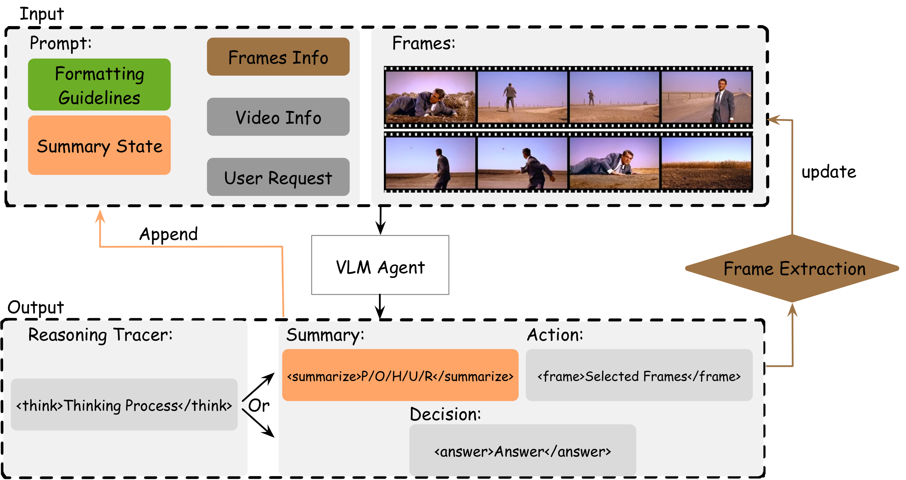
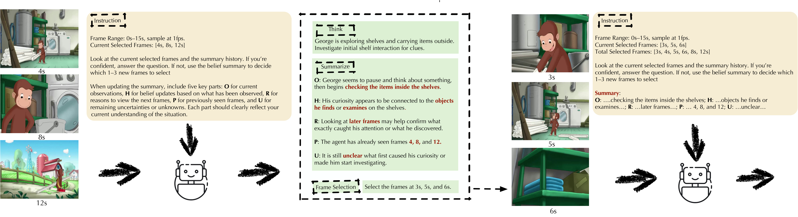

# REVISE: Reasoning with Video Sparsity

This repository contains the code for **REVISE**, a framework for question-aware sparse video understanding.

REVISE addresses two core challenges in video QA: **information overload** (processing too many redundant frames) and **insufficient key-information awareness** (missing the frames that actually matter). It does so through a multi-round agent loop that iteratively selects a small number of informative frames while maintaining a compact **summary-as-state** across rounds.

For the repository dependency boundaries and extension rules, see
[`ARCHITECTURE.md`](ARCHITECTURE.md).

## Method Overview

<p align="center">
  
</p>

**Summary-as-State.** REVISE operates analogously to a recurrent neural network: it maintains a compact state that propagates information from previous rounds to the VLM, without re-admitting raw frames or conversation history.

<p align="center">
  
</p>

Each round, the agent receives sampled video frames, the question, and its current summary state. Every response begins with a `<think>` reasoning trace, then commits a structured summary (in `<summarize>`) using the **POHR** format:

| Field | Description |
|-------|-------------|
| **P** (Previously seen) | What frames have been inspected so far |
| **O** (Observations) | What was just observed in the current frames |
| **H** (Hypotheses) | How observations update the current belief |
| **U** (Uncertainties) | What remains unclear |
| **R** (Reasons) | Why specific new frames are needed, or why the question is now answerable |

The agent then either requests more frames (`<select>`, on a round that also commits a `<summarize>`) or produces a final answer (`<think>` + `<answer>`, reusing the last committed summary). Only the summary persists between rounds — not the `<think>` trace, raw frames, or conversation history — keeping the context compact.

**Two operating modes:**

1. **Plug-and-play**: wraps any VLM (including proprietary APIs like GPT-4o) as a frozen black-box — no parameter updates needed.
2. **RL fine-tuning**: uses GRPO with the **EAGER** (Evidence-Adjusted Gain for Efficient Reasoning) reward, which combines confidence gain, summary sufficiency, and correct-and-early-stop bonuses — all annotation-free.

### Qualitative Example

<p align="center">
  
</p>

The agent starts with 3 uniformly sampled frames, updates its POHR summary, identifies uncertainty, requests targeted frames, and arrives at the answer — all within 2 rounds using only 6 frames from a 15-second video.

## Reported Results Under Reproduction Audit

The numbers below are the originally reported paper numbers. They are kept for traceability while
the full reproduction suite is rerun with the corrected evaluation pipelines. Do not treat them as
newly verified results until the full reproduction suite has completed and the paper tables
are refreshed from those outputs.

| Benchmark | Model | Accuracy | Avg Frames |
|-----------|-------|----------|------------|
| VideoEspresso | GPT-4o + REVISE | 48.9% | 8.0 |
| NExT-QA | GPT-4o + REVISE | 63.8% | 8.4 |
| EgoSchema | GPT-4o + REVISE | 60.6% | 9.8 |
| NExT-QA | Qwen2.5-VL-3B + REVISE + RL | 51.3% | 3.9 |

In the original paper table, RL fine-tuning yielded **+19.6pp accuracy** over
plug-and-play on NExT-QA while using fewer frames, fewer rounds, and nearly 2x
faster inference. The current open-source reproduction audit has not yet
re-verified that exact row.

<p align="center">
  
</p>

More rounds yield better accuracy at lower average frame budgets — the agent learns to stop early when confident.

## Installation

```bash
conda create -n verlrun python=3.10 -y
conda activate verlrun

pip install -U pip
pip install -e .
```

Install the inference backend you plan to use:

```bash
# SGLang (recommended)
pip install -r requirements_sglang.txt

# vLLM
pip install -r requirements.txt
# or: pip install -e ".[vllm]"

# GPU extras (flash-attention, liger-kernel)
pip install -e ".[gpu]"
```

## Quickstart

Paper-level reproduction entrypoints:

```bash
ENV_NAME=verlrun INSTALL_BACKENDS=vllm bash scripts/setup_env.sh
python scripts/doctor.py --scope nextqa
python scripts/paper_suite.py list
```

### Replicate Table 4 on NExT-QA

Table 4 is exposed as four explicit paper-suite IDs. The full commands use the
official NExT-QA split, `max_rounds=4`, `max_frames_per_round=3`, vLLM tensor
parallelism over 4 GPUs, and the audited after-SFT EAGER setting for RL. See
[`docs/NEXTQA_TABLE4_REPRO.md`](docs/NEXTQA_TABLE4_REPRO.md) for the current
reproduction audit: the corrected RFT setting is runnable and observed but still
below the paper target, while the paper direct/PnP baseline rows require the
original Table 4 checkpoint via
`REVISE_NEXTQA_TABLE4_BASE_MODEL`; the current public Qwen2.5-VL-3B-Instruct
snapshot is too strong to reproduce those two rows.

```bash
python scripts/paper_suite.py check \
  --experiment nextqa_table4_direct \
  --experiment nextqa_table4_pnp \
  --experiment nextqa_table4_sft \
  --experiment nextqa_table4_rl_after_sft

python scripts/paper_suite.py report \
  --experiment nextqa_table4_direct \
  --experiment nextqa_table4_pnp \
  --experiment nextqa_table4_sft \
  --experiment nextqa_table4_rl_after_sft \
  --output-dir outputs/repro_runs/table4_nextqa \
  --output-json outputs/repro_runs/table4_nextqa/report.json

# For RL logging, export WANDB_API_KEY in your shell before launching.
python scripts/paper_suite.py run --experiment nextqa_table4_rl_after_sft \
  --output-dir outputs/repro_runs/table4_nextqa
```

For Table 4 direct/PnP, set the paper baseline checkpoint before `check` or
`run`:

```bash
export REVISE_NEXTQA_TABLE4_BASE_MODEL=/path/to/original/table4/baseline/checkpoint
python scripts/paper_suite.py run --experiment nextqa_table4_pnp \
  --output-dir outputs/repro_runs/table4_nextqa
```

The report JSON uses `readiness_status` for runnable/blocker state,
`paper_reproduction_status` for the suite-level paper claim,
`paper_target_metrics` for the Table 4 reference numbers from the paper,
`paper_target_delta` for observed-minus-target gaps, and `observed_metrics` for
metrics parsed from local run summaries. Use `verification_status` to
distinguish paper-comparable `observed` runs from `observed_with_blockers`
diagnostic summaries. Do not treat readiness or observed metrics alone as a
verified paper result.

For a public-checkpoint plug-and-play sanity run, use the generic non-Table-4
experiment instead:

```bash
python scripts/paper_suite.py run --experiment nextqa_pnp \
  --output-dir outputs/repro_runs/nextqa_public_pnp
```

Use `--smoke` for a one-sample preflight. PnP/evaluation smoke runs reduce
tensor parallelism and sample count. The RL-after-SFT smoke command still
requires 4 visible GPUs because the training batch is sized to exercise the
same multi-GPU rollout path; use the full commands above for paper-comparable
numbers.

### Experimental Qwen3.5-4B ablation

The paper rows stay pinned to the Table 4 checkpoint/Qwen2.5-VL setting. For a
stronger non-paper ablation, the NExT-QA PnP and teacher-generation commands can
use `Qwen/Qwen3.5-4B` when configured explicitly:

```bash
python scripts/download_hf_models.py --model qwen35_4b
export REVISE_QWEN35_4B_PATH="$PWD/data/revise_assets/models/Qwen3.5-4B"

# Or point directly at a served/HF model ID for PnP-only experiments.
export REVISE_LOCAL_MODEL_PATH=Qwen/Qwen3.5-4B
export REVISE_LOCAL_MODEL_ID=Qwen/Qwen3.5-4B

python scripts/paper_suite.py run --experiment nextqa_pnp --output-dir outputs/repro_runs/qwen35_nextqa
```

This is intentionally separate from `nextqa_table4_*`: Qwen3.5-4B changes the
backbone and may require a newer backend stack that recognizes `model_type:
qwen3_5` in Transformers/vLLM, or a remote OpenAI-compatible server already
serving that model. Treat it as an ablation until a smoke run passes.

If you do not already have an NExT-QA SFT checkpoint, generate train-split
teacher data first. The paper-preferred path is a local/served teacher via
`./revise/run_generate_teacher_data.sh`. A GPT-5-mini Batch bootstrap path is
also available and converts back to the same teacher-log JSONL. Generated
traces are variable length: they contain 1 to `--max-rounds` assistant rounds,
all non-final rounds are `<select>` rounds, and the final round is the first
`<answer>` round. This matches the shared REVISE loop used by both PnP and RL
and avoids teaching the learner to spend the full round budget by default.
NExT-QA frame actions use a 1-fps timeline in both PnP and RL. The script omits
`service_tier` by default because Flex availability is
model/account dependent; pass `--service-tier flex` only when your OpenAI
project supports it for the selected model.

```bash
python scripts/nextqa_openai_teacher_batch.py prepare \
  --max-samples 8000 \
  --output-jsonl outputs/openai_batch/nextqa_teacher_requests.jsonl \
  --manifest outputs/openai_batch/nextqa_teacher_manifest.jsonl

# Requires OPENAI_API_KEY and creates one OpenAI Batch job.
python scripts/nextqa_openai_teacher_batch.py submit \
  --input-jsonl outputs/openai_batch/nextqa_teacher_requests.jsonl \
  --output-json outputs/openai_batch/nextqa_teacher_batch.json

# After downloading the completed batch output JSONL:
python scripts/nextqa_openai_teacher_batch.py convert \
  --batch-output outputs/openai_batch/nextqa_teacher_batch_output.jsonl \
  --manifest outputs/openai_batch/nextqa_teacher_manifest.jsonl \
  --output-log outputs/nextqa_teacher_train_log.jsonl

SFT_INPUT=outputs/nextqa_teacher_train_log.jsonl \
SFT_GENERATE_ARGS="--max-rounds 4 --min-first-select-ratio 0.45" \
SFT_CKPT_DIR=outputs/revise_nextqa_sft \
./revise/run_revise_nextqa_sft.sh

export REVISE_NEXTQA_SFT_PATH="$(find outputs/revise_nextqa_sft -type d \( -name huggingface -o -name hf_model \) | sort -V | tail -1)"
```

`run_revise_nextqa_sft.sh` writes `revise_sft_provenance.json` beside the SFT
checkpoint. `paper_suite.py report` requires that provenance, or an equivalent
`nextqa_table4_sft.settings.json` next to the eval summary, before treating a
Table 4 SFT summary as observed.

`scripts/doctor.py` defaults to the NExT-QA/Table-4 scope. Use
`python scripts/doctor.py --scope paper` when checking every dataset used in
the paper.

Current reproduction behavior:

- NExT-QA caption baselines auto-generate missing caption caches when `REVISE_NEXTQA_CAPTIONS_DIR` is unset.
- EgoSchema falls back to Hugging Face subset metadata and downloads required videos on demand if no local EgoSchema assets are configured.
- VideoEspresso RL reproduction can synthesize a local MC train JSON from the public open-ended train file via `scripts/prepare_videoespresso_mc_train.py`.

### Plug-and-play evaluation (NExT-QA)

```bash
export REVISE_NEXTQA_TABLE4_BASE_MODEL=/path/to/original/table4/baseline/checkpoint
python scripts/paper_suite.py run --experiment nextqa_table4_pnp \
  --output-dir outputs/repro_runs/table4_nextqa
```

Without the original Table 4 baseline checkpoint, use `nextqa_pnp` for
public-checkpoint development rather than reporting the result as Table 4.

### RL fine-tuning (GRPO + EAGER reward)

```bash
python scripts/paper_suite.py run --experiment nextqa_table4_rl_after_sft \
  --output-dir outputs/repro_runs/table4_nextqa
```

Training and RL scripts invoke the VERL Hydra entry points. Plug-and-play and
one-shot evaluation use `revise/pnp_cli.py` so dataset, backend, and setting
selection stay in one public command surface.

```bash
python3 -m verl.trainer.main_ppo \
  --config-path $(pwd)/revise/config \
  --config-name <config_name> \
  actor_rollout_ref.rollout.name=vllm \
  [hydra overrides ...]
```

### Standalone evaluation

```bash
python revise/pnp_cli.py --dataset lvbench --backend hf_inprocess
python revise/pnp_cli.py --dataset lvbench --backend vllm_http
python revise/pnp_cli.py --dataset lvbench --backend vllm_http --setting oneshot_baseline
python revise/benchmarks/nextqa_caption_vllm.py  # Caption-only baseline
```

Use `revise/pnp_cli.py` for plug-and-play and one-shot evaluation. Dataset,
backend, and setting are separate flags; benchmark-specific scripts are kept
only where they implement a distinct evaluator such as caption-only NExT-QA.

## Repository Structure

```
revise/            # REVISE package root and launchers
  datasets/       # Dataset/sample loaders and task adapters
  backends/       # Inference runtimes such as vLLM HTTP and HF in-process
  benchmarks/     # Per-benchmark CLIs and paper-suite entry points
  run_*.sh        # Hydra launchers for eval, SFT, and GRPO
  pnp/            # Shared loop engine, protocols, prompts, registry, utilities
  config/         # YAML configs for eval / GRPO / ablations
scripts/           # Reproduction tooling: asset download, doctor, paper suite
tests/             # Unit tests

verl/
  trainer/
    main_ppo.py    # Hydra entry point for training and evaluation
    ppo/           # RayPPOTrainer, GRPO/GAE core algorithms, reward loading
    config/        # Base Hydra configs (ppo_trainer.yaml, component defaults)
  experimental/
    agent_loop/    # Agent loop implementations
      revise_agent_loop.py   # Core REVISE multi-round loop (POHR, frame selection)
      agent_loop.py          # AgentLoopBase + @register decorator
      single_turn_agent_loop.py
      tool_agent_loop.py
  workers/
    rollout/       # Inference backends: sglang, vllm, hf_server
    reward_manager/# Reward computation strategies
  utils/
    dataset/       # Dataset loaders (NExT-QA, LVBench, etc.)
    reward_score/  # Reward scoring functions
```

## Datasets

Dataset paths are configured in `revise/config/*.yaml`. Supported benchmarks:

| Dataset | Format | Key config fields |
|---------|--------|-------------------|
| **NExT-QA** | Local CSV + videos | `data.nextqa.video_root`, `data.nextqa.map_json` |
| **LVBench** | HuggingFace dataset + video cache | `data.lvbench.video_cache_dir` |
| **Video-MME** | HuggingFace dataset + video cache | similar to LVBench |
| **EgoSchema** | Egocentric video QA | configured per-script |
| **VideoEspresso** | 14 fine-grained reasoning categories | configured per-script |

## Configuration

The project uses [Hydra](https://hydra.cc/) for configuration management. Configs are composed from:

1. **Base config** at `verl/trainer/config/ppo_trainer.yaml` (actor, rollout, critic, algorithm defaults)
2. **Experiment configs** at `revise/config/` that override the base

Key REVISE-specific settings live under `actor_rollout_ref.rollout.revise`:

```yaml
revise:
  max_rounds: 4              # maximum reasoning rounds
  max_frames_per_round: 3    # frames selected per round
  max_retries_per_round: 1   # retries on parse failure
  initial_sampling: uniform  # first-round frame strategy
  include_timestamps: True
```

Agent loop selection: `actor_rollout_ref.rollout.agent.default_agent_loop: revise_agent`

## Hardware

- Recommended: 4 GPUs with tensor-parallel vLLM/SGLang
- Experiment tracking via [wandb](https://wandb.ai/); set `WANDB_API_KEY` in the shell for training
- Distributed training uses [Ray](https://www.ray.io/) + FSDP

## License

Apache-2.0 (see `LICENSE`). This repo includes code adapted from the original [verl](https://github.com/volcengine/verl) project.
